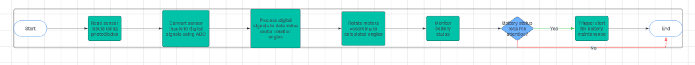
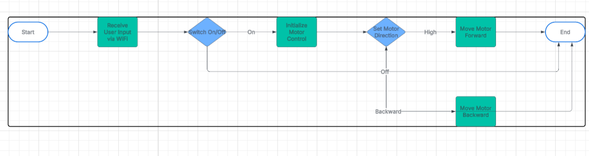
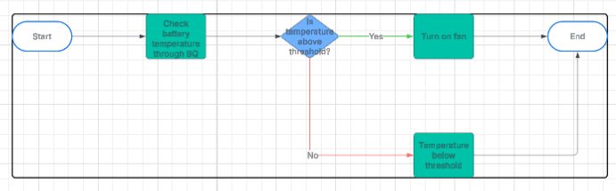
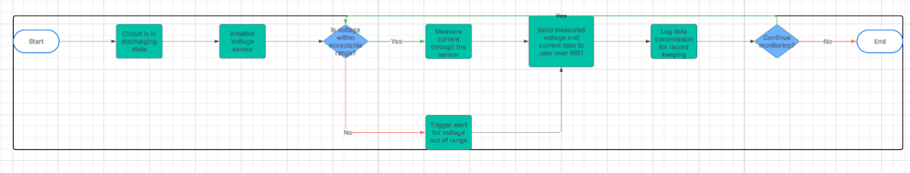
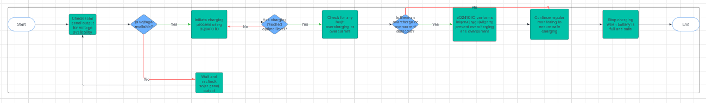
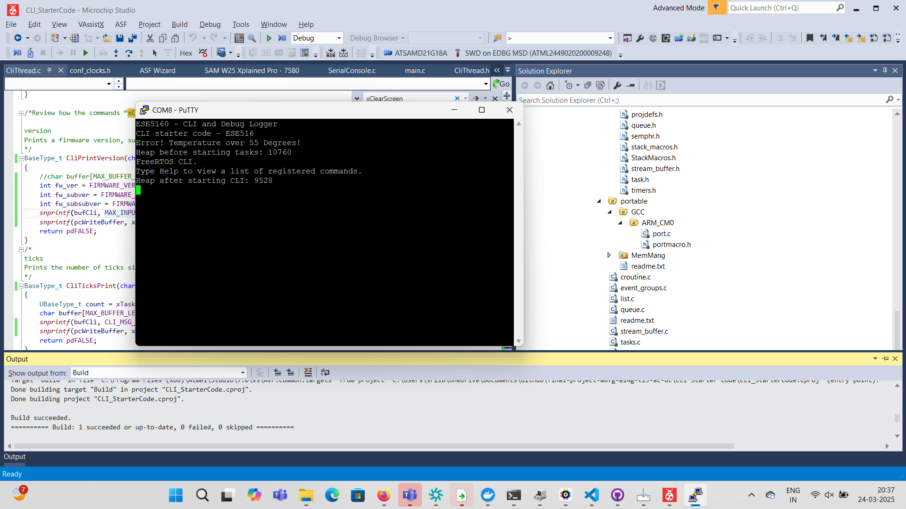
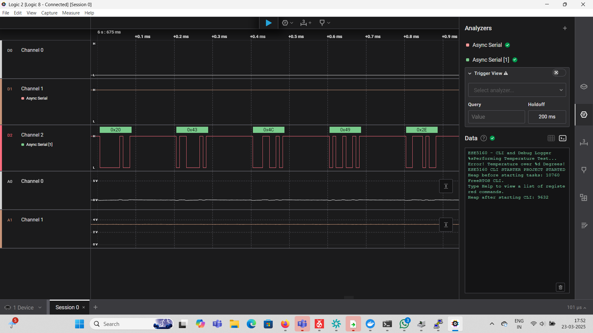

# a07g-exploring-the-CLI

* Team Number: 19
* Team Name: AC-DC
* Team Members: Madison Hughes and Aditya Rangamani
* GitHub Repository URL: https://github.com/ese5160/final-project-a07g-a14g-t19-ac-dc.git
* Description of test hardware: (development boards, sensors, actuators, laptop + OS, etc)

## Software Architecture

3. I have split the entire system into 5 tasks which I have listed below

   

   

   

   

### Understanding the Starter Code

1. What does “InitializeSerialConsole()” do? In said function, what is “cbufRx” and “cbufTx”? What type of data structure is it?

   This function initializes the serial communication. It starts by setting the circular buffers Rx and Tx (Rx for receiving data and Tx for transmitting data) equal to initial values. The data structures are circular buffers. It then configures USART and the USART callbacks which includes things like the baud rate of communication.
2. How are “cbufRx” and “cbufTx” initialized? Where is the library that defines them (please list the *C file they come from).

   For intializaton of a circular buffer, you define the head. During a write, the head doesnt change, however, during a read, the head is moved to the next item in the buffer. You then define the tail. In a write, data is placed at the position of the tail and then it moves to the next location. In a read it remains unchanged. It is essentially the opposite of the head. Finally, you define the max, which is the total number of elements the buffer can hold. There is also a boolean which indicates if the buffer is full or not.
   In the circular_buffer_init() function, first space is allocated in memory with malloc() with the size of the buffer. Then the buffer's data and max size of the buffer is set. The internal state of the buffer is reset with circular_buf_reset() to reset the head and tail.
3. Where are the character arrays where the RX and TX characters are being stored at the end? Please mention their name and size.
   Tip: Please note cBufRx and cBufTx are structures.

   They are being stored in the structures "cBufRx" and "cBufTx". There are arrays called rxCharacterBuffer[] and txCharacterBuffer[] respectively. the size of each one is 512 characters. These are elements of each structure.
4. Where are the interrupts for UART character received and UART character sent defined?

   They are defined in configure_usart_callbacks(). This function dictates what happens when the "character transmitting" and "character receiving" interrupts have been triggered. It calls "usart_register_callback()" which registers each 'flag' (transmitting or receiving) to callbacks. It then calls usart_enable_callback() which enables these callback functions to happen.
5. What are the callback functions that are called when:

   a. A character is received? (RX)

   usart_read_callnack()

   a. A character has been sent? (TX)

   usart_write_callnack()
6. Explain what is being done on each of these two callbacks and how they relate to the cbufRx and cbufTx buffers.

   The usart_read_callback() gets called when all of the data has been received that was requested from a UART read and it is ready to receive another byte of data. It would get the data byte from the USART and store it in the buffer cBufRx.
   The usart_write_callback() gets called when the USART is ready for more data to be sent. This means that it gets the next amount of data that needs to be written from the cBufTx structure. If there is more data to be sent then it sends it to the USART hardware.
7. Draw a diagram that explains the program flow for UART receive – starting with the user typing a character and ending with how that characters ends up in the circular buffer “cbufRx”. Please make reference to specific functions in the starter code.
8. Draw a diagram that explains the program flow for the UART transmission – starting from a string added by the program to the circular buffer “cbufTx” and ending on characters being shown on the screen of a PC (On Teraterm, for example). Please make reference to specific functions in the starter code.
9. What is done on the function “startStasks()” in main.c? How many threads are started?

   It initializes tasks needed for the application. It first checks if there is heap size available. Then it initializes all of the tasks needed for the application. Then it creates the CLI task which is represented by vCommandConsoleTask. If it fails, it prints an error message to the serial console. Then it checks the heap memory space after the tasks have been created. There are 2+ threads created. The CLI task is created, it also creates the systme idle task. Finally, depending on how many additional tasks are created, there will be more threads than these intitial 2.

## Wiretap the Convo

1. What nets must you attach the logic analyzer to? (Check how the firmware sets up the UART in SerialConsole.c!)
2. Where on the circuit board can you attach / solder to?
   1. The logic analyzer can be connected to the SERCOM pins. In our case since we are looking for UART they can be found in PB10 and PB11 which corresponds to SERCOM4.
3. What are critical settings for the logic analyzer?
   1. The logic analyzer needs to know the channels that are input/output, the baud rate for UART, the bit frame- number of data bits, parity bits etc. In our case the baud rate is set to 115200.

Video link: https://drive.google.com/file/d/1xVz9SYXsYTk-hGG72L9eMZwvI8QJIvLB/view?usp=drive_link

### Logic Analyzer screenshot

## Add CLI commands

Video link: https://drive.google.com/file/d/1xYLHueic-cgsnsxpwUmjO-qyBjLpzvr9/view?usp=drive_link
